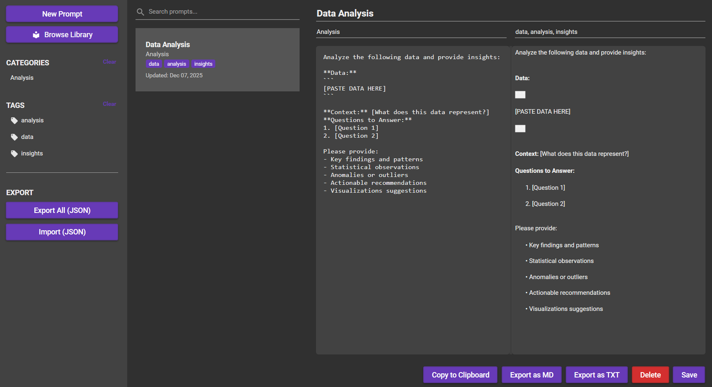

<p align="center">
  
</p>

<p align="center">

  <!-- Release -->
  <a href="https://github.com/Gown-dono/PromptBox/releases">
    
  </a>

  <!-- Downloads -->
  <a href="https://github.com/Gown-dono/PromptBox/releases">
    
  </a>

  <!-- License -->
  <a href="https://github.com/Gown-dono/PromptBox/blob/main/LICENSE">
    
  </a>

  <!-- Issues -->
  <a href="https://github.com/Gown-dono/PromptBox/issues">
    
  </a>

</p>
  
# PromptBox — AI Prompt Manager on Your Desktop

A modern, feature-rich WPF desktop application for managing AI prompts. Create, edit, organize, search, and export prompts for ChatGPT, GitHub Copilot, Claude, and other AI models.



## Features

### Core Functionality
- **Prompt Management**: Create, edit, delete, and view prompt entries
- **Rich Metadata**: Each prompt includes title, category, tags, content, and timestamps
- **Markdown Support**: Write prompts in Markdown with real-time preview
- **Advanced Search**: Instant search across titles, tags, categories, and content
- **Tag System**: Multi-tag support with visual tag display and filtering
- **Category Organization**: Organize prompts by categories
- **Prompt Library Browser**: Browse and import prompts from a curated library
- **Version History (Git-like)**: One-click restore to any previous version with visual diff
- **AI Prompt Builder**: Create and test prompts with multiple AI models
### Import/Export
- Export individual prompts as Markdown (`.md`) or plain text (`.txt`)
- Export all prompts as JSON for backup
- Import prompts from JSON files

### User Experience
- **Modern UI**: Built with Material Design for a clean, professional look
- **Theme Support**: Toggle between Light and Dark modes
- **Clipboard Integration**: One-click copy to clipboard
- **Local First**: All data stored locally using LiteDB
- **Fast Performance**: Optimized search and filtering

## Architecture

Built using **MVVM (Model-View-ViewModel)** pattern with clean separation of concerns:

```
PromptBox/
├── Models/              # Data models (Prompt, Category, Tag)
├── ViewModels/          # MVVM ViewModels with business logic
├── Views/               # XAML views and UI
├── Services/            # Business services (Database, Theme, Export, Search)
├── Properties/          # Application settings
└── Data/                # LiteDB database storage (created at runtime)
```

## Technology Stack

- **.NET 8.0** - Modern .NET framework
- **WPF** - Windows Presentation Foundation
- **MaterialDesignThemes** - Material Design UI components
- **LiteDB** - Lightweight NoSQL database for local storage
- **Markdig.Wpf** - Markdown rendering
- **CommunityToolkit.Mvvm** - MVVM helpers and commands
- **Dependency Injection** - Microsoft.Extensions.DependencyInjection

## Installation

### Prerequisites
- Windows 10/11
- .NET 8.0 SDK or Runtime

### Build from Source

1. Clone the repository:
```bash
git clone https://github.com/Gown-dono/PromptBox-AI-Prompt-Manager.git
cd PromptBox-AI-Prompt-Manager
```

2. Restore NuGet packages:
```bash
dotnet restore
```

3. Build the solution:
```bash
dotnet build
```

4. Run the application:
```bash
dotnet run --project PromptBox/PromptBox.csproj
```

### Release Build

```bash
dotnet publish -c Release -r win-x64 --self-contained
```

The compiled application will be in `PromptBox/bin/Release/net8.0-windows/win-x64/publish/`

## Usage

### Creating a Prompt
1. Click **"New Prompt"** in the left sidebar
2. Enter a title, category, and tags (comma-separated)
3. Write your prompt content in the left editor (Markdown supported)
4. Preview renders in real-time on the right
5. Click **"Save"** to store the prompt

### Searching and Filtering
- Use the search bar to find prompts by title, content, tags, or category
- Click on a category in the sidebar to filter by category
- Click on a tag to filter by that specific tag
- Clear filters by clicking the selected item again

### Exporting
- **Single Prompt**: Select a prompt and use "Export as MD" or "Export as TXT"
- **All Prompts**: Use "Export All (JSON)" in the sidebar for backup
- **Copy to Clipboard**: Quick copy button for immediate use

### Importing
- Click "Import (JSON)" in the sidebar
- Select a previously exported JSON file
- All prompts will be imported as new entries

## Data Storage

All data is stored locally in:
```
PromptBox/Data/promptbox.db
```

This LiteDB database file contains all your prompts, categories, and tags. You can back it up by copying this file.

## Contributing

Contributions are welcome! Please feel free to submit a Pull Request.

1. Fork the repository
2. Create your feature branch (`git checkout -b feature/AmazingFeature`)
3. Commit your changes (`git commit -m 'Add some AmazingFeature'`)
4. Push to the branch (`git push origin feature/AmazingFeature`)
5. Open a Pull Request

## License

This project is licensed under the MIT License - see the [LICENSE](LICENSE) file for details.

## Acknowledgments

- [MaterialDesignInXAML](https://github.com/MaterialDesignInXAML/MaterialDesignInXamlToolkit) - Beautiful Material Design components
- [LiteDB](https://github.com/mbdavid/LiteDB) - Lightweight NoSQL database
- [Markdig](https://github.com/xoofx/markdig) - Markdown processor
- [CommunityToolkit.Mvvm](https://github.com/CommunityToolkit/dotnet) - MVVM helpers

## Contact

Project Link: [https://github.com/Gown-dono/PromptBox](https://github.com/Gown-dono/PromptBox)
